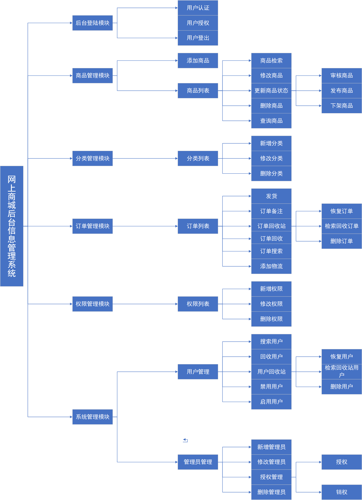

### 项目介绍

本项目的系统为网上商城后台信息管理系统，为网上商城提供数据维护和管理，实现服务和管理分离。项目使用J2EE三层结构。

### 项目功能

- 后台登陆
  - 后台登陆：进行后台用户登陆身份的认证、授权
  - 后台登出：对登入系统的用户进行退出处理
- 后台管理
  - 商品管理：对商品信息进行管理，包括新增、修改、删除、搜索商品功能
  - 分类管理：管理和维护商品的分类信息
  - 订单管理：查询前台用户创建的订单信息，维护管理订单信息
  - 权限管理：管理后台系统的资源访问权限
  - 用户管理：维护前台系统的用户信息
  - 管理员管理：维护后台系统的用户信息和授权信息

项目功能模块

### 技术介绍

#### 1、前端使用的技术

- [Bootstrap](https://www.bootcss.com/)：是对html、css和JavaScript进行了轻量级包装的优秀的前端开发框架
- [bootstrap-paginator](https://github.com/lyonlai/bootstrap-paginator)：基于bootstrap的JQuery分页插件
- [JQuery](https://jquery.com/)：jQuery是一个快速、小型且功能丰富的JavaScript库。它使用一个在多种浏览器上工作的易于使用的API，使得HTML文档遍历和操作、事件处理、动画和Ajax等工作变得更加简单。随着多功能性和可扩展性的结合，jQuery改变了数百万人编写JavaScript的方式。
- [JavaScript](https://www.javascript.com/)：解释型编程语言
- [AJAX](https://www.w3school.com.cn/ajax/index.asp)：全名Asynchronous JavaScript and XML，即异步的 JavaScript 和 XML，它是一种在不重新加载整个页面的情况下，实现与服务器交换数据并更新部分网页的技术。
- [niftymodals](https://github.com/foxythemes/jquery-niftymodals)：一款基于bootstrap的模态框插件

#### 2、后端使用的技术

- [Spring](https://spring.io/)：J2EE应用程序框架，提供了功能强大IOC、[AOP](https://baike.baidu.com/item/AOP/1332219)及Web MVC等功能，可集成其他框架使用
- [SpringMVC](https://docs.spring.io/spring/docs/current/spring-framework-reference/web.html)：是基于Servlet API构建的原始Web框架，SpringFrameWork的一个子模块，表现层框架
- [Mybatis](https://mybatis.org/mybatis-3/)：是基于JDBC API的java持久层框架，支持自定义 SQL、存储过程以及高级映射，通过简单的 XML 或注解来配置和映射原始类型、接口和 Java POJO（Plain Old Java Objects，普通老式 Java 对象）为数据库中的记录
- [MySQL](https://www.mysql.com/)：关系型数据库，目前是Oracle旗下产品
- [Shiro](http://shiro.apache.org/)：Simple. Java. Security.（简单java安全框架），也是Apache的一个项目
- [Tomcat](https://tomcat.apache.org/)：Tomcat是Apache 的一个项目，是目前比较流行的web应用服务器
- [c3p0](https://www.mchange.com/projects/c3p0/)：一个开源的JDBC连接池

### 项目目录结构

- src

  - main
    - java
    - resource
    - webapp

- web

  - css

  - font

  - images

  - js

    - other

  - vendor

  - WEB-INF

    - jsp

    - META-INF

      web.xml

  InitDataBase.sql

  pom.xml

  README.md

  ENVIROMENET.txt

说明：

1. java目录存放的是系统的所有相关类，包括配置、Controller层接口、Service层接口、Service接口实现类、DAO层接口及映射xml文件、数据库映射实体类、前端映射实体类、工具类
2. resource目录存放的是相关的配置文件，包括数据库配置文件、Mybatis配置文件、整合Mybatis+Spring+SpringMVC+Shiro配置文件、Spring配置文件、子目录lib存放的是第三方依赖包
3. webapps是打包时用于映射到web目录的
4. web目录存放的是项目的前端文件
5. css目录存放的是项目系统页面的样式控制文件
6. font目录存放的是前端页面字体图标库
7. js目录存放的是页面处理业务的JavaScript文件，子目录存放的是第三方js库文件
8. images目录存放的是系统页面背景图片文件
9. WEB-INF目录是项目系统的jsp展示页面文件
10. InitDataBase.sql文件是项目的数据库初始化文件，用于创建项目使用的数据库和各个数据表，包含了对数据表的详细说明
11. pom.xml是项目的所有依赖配置文件
12. ENVIROMENT.txt是项目运行和部署环境的说明文件
13. README.md是项目的介绍文档

### 项目部署

#### 1、Windows本地部署

- 下载zip直接解压或者使用git命令：git clone https://github.com/hansonlee2020/dreamMall.git (需要安装git)
- 安装JDK11、Tomcat服务器、MySQL数据库[安装参考教程](https://www.cnblogs.com/BoKeYuan259/p/10966137.html)、Maven、IDEA开发工具

- 在IDEA中配置好JDK路径、Tomcat路径、MySQL路径
- 打开MySQL服务，执行InitDataBase.sql文件(可以安装MySQL可视化平台Navicat for MySQL[安装教程参考](https://www.cnblogs.com/runw/p/12255962.html)或者MySQL Workbench[安装教程参考](https://dev.mysql.com/downloads/workbench/)），也可以复制sql文件里的内容到控制台命令行直接执行(需要登陆到mysql服务[MySQL使用教程](https://www.cnblogs.com/shierlou-123/p/11207508.html))
- 如果MySQL数据库连接配置和项目的resource-->database.properties的配置不一致，需要在该文件里进行修改，MySQL5.0及以下，驱动所在路径为com.mysql.jdbc.Driver，5.0版本以上为com.mysql.cj.jdbc.Driver，而且需要在url后面加上时区设置&serverTimezone=Asia/Shanghai，否则连接数据库时会出错
- 项目系统默认使用Tomcat默认端口localhost:8080,初始账号自行配置，***建议***：**在进行Tomcat配置时，Application context配置为/，表示当前项目目录即root目录，否则，访问时需要以**localhost:8080/项目名**的形式进行访问**

#### 2、Linux服务器部署

- 安装JDK11[教程参考](https://www.cnblogs.com/xiaoyiStudent/p/12250305.html)
- 安装Tomcat[教程参考](https://www.jianshu.com/p/dfddbd8da05d)、MySQL[教程参考1](https://blog.csdn.net/qq_39170130/article/details/87938755)|[教程参考2](https://blog.csdn.net/weixin_39082031/article/details/105783765)
- 使用IDEA将项目打war包[教程参考](https://www.bilibili.com/video/BV1ra4y1i7wi)
- 将war包上传到Linux服务器上，上传文件使用应用[WinSCP](https://winscp.net/eng/docs/lang:chs)，远程连接Linux服务器使用[Putty](https://www.chiark.greenend.org.uk/~sgtatham/putty/)
- Linux下启动mysql，启动Tomcat，（关于阿里云服务器下无法访问Tomcat8080端口问题[解决方案](https://blog.csdn.net/xl715/article/details/83623884)）
- 关于war包放入linux服务器Tomcat中的路径访问问题具体[参考](https://www.jb51.net/article/185065.htm)
- 部署完成，访问项目形式：服务器公网ip:8080/（如果上一条的设置没有进行，访问形式为：服务器公网ip:8080/项目完整包名）

### 项目地址

- 项目源码：https://github.com/hansonlee2020/dreamMall.git
- 项目演示：http://hansonlee.top
- 关于作者：https://github.com/hansonlee2020